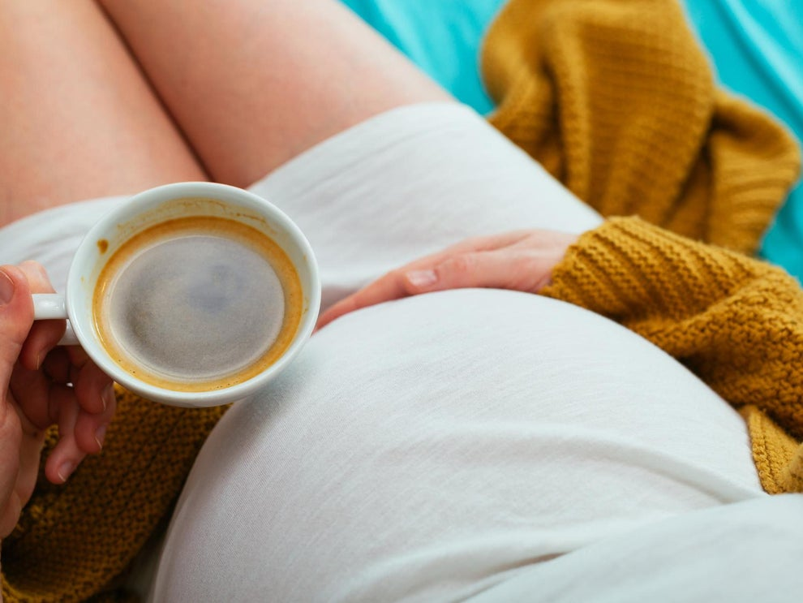

Women who are [pregnant](https://www.independent.co.uk/topic/Pregnancy) or trying for a baby should consider avoiding [caffeine](https://www.independent.co.uk/topic/caffeine) completely due to evidence suggesting there is no safe level of consumption, researchers have said.

An analysis of observational studies published in *BMJ Evidence-Based Medicine* found evidence to suggest maternal caffeine consumption was associated with negative pregnancy outcomes.

The widespread existing advice to pregnant women is consuming a small amount of caffeine – found naturally in food and drinks such as tea and coffee – each day will not harm their baby.

The [NHS](https://www.independent.co.uk/topic/NHS), the American College of Obstetricians and Gynaecologists and the [European Food Safety Authority](https://www.independent.co.uk/topic/european-food-safety-authority) set this safe level of consumption at 200 mg of caffeine – the equivalent of roughly two cups of moderate-strength [coffee](https://www.independent.co.uk/topic/Coffee) per day.

The widespread existing advice to pregnant women is consuming a small amount of caffeine – found naturally in food and drinks such as tea and coffee – each day will not harm their baby.

The [NHS](https://www.independent.co.uk/topic/NHS), the American College of Obstetricians and Gynaecologists and the [European Food Safety Authority](https://www.independent.co.uk/topic/european-food-safety-authority) set this safe level of consumption at 200 mg of caffeine – the equivalent of roughly two cups of moderate-strength [coffee](https://www.independent.co.uk/topic/Coffee) per day.

But Professor Jack James, a psychologist at [Iceland](https://www.independent.co.uk/topic/Iceland)’s Reykjavik University, said such advice was “not consistent with the level of threat”.

His analysis concluded there was “substantial cumulative evidence” of a link between maternal caffeine consumption and diverse negative pregnancy outcomes such as miscarriages and childhood obesity.

The study carried out a review of current evidence on caffeine-related pregnancy outcomes to determine whether the recommended safe level of consumption for pregnant women was soundly based.

After examining data from 37 observational studies, Prof James found 32 of these studies reported that caffeine significantly increased risk of adverse pregnancy outcomes including stillbirth, miscarriage and low birth weight.

He also cited an increased risk of childhood acute leukaemia and children being overweight or obese when born to mothers who consume caffeine during pregnancy.